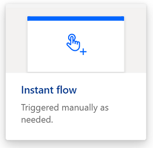
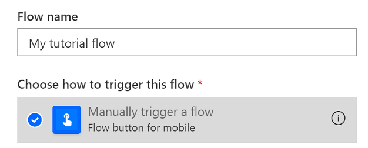

# Run Office Scripts in Excel on the web with Power Automate

This tutorial will teach you how to run an Office Script for Excel on the web through [Power Automate](https://flow.microsoft.com).

## Prerequisites

Before starting this tutorial, you'll need access to Office Scripts, which requires the following:

- [Excel on the web](https://www.office.com/launch/excel).
- Ask your administrator to [enable Office Scripts for your organization](https://support.office.com/article/office-scripts-settings-in-m365-19d3c51a-6ca2-40ab-978d-60fa49554dcf), which adds the **Automate** tab to the ribbon.
- [Preview access to Power Automate](https://us.tip1.flow.microsoft.com).

> [!IMPORTANT]
> This tutorial assumes you have completed the [Record, edit, and create Office Scripts in Excel on the web](excel-tutorial.md) tutorial.

## Prepare the workbook

We need to set up a workbook with specific workbook and worksheet names. This is because Power Automate cannot use relative Office Script APIs, such as `Workbook.getActiveWorksheet`.

1. Create a new workbook named **MyWorkbook**.

2. In the **MyWorkbook** workbook, create a worksheet called **TutorialWorksheet**.

## Create an Office Script

1. Go to the **Automate** tab and select **Code Editor**.

2. Select **New Script**.

3. Replace the default script with the following script. This script adds the current date and time to the first two cells of the **TutorialWorksheet** worksheet.

    ```TypeScript
    async function main(context: Excel.RequestContext) {
      // Get the "TutorialWorksheet" worksheet from the workbook.
      let worksheet = context.workbook.worksheets.getItem("TutorialWorksheet")

      // Get the cells at A1 and B1.
      let dateRange = worksheet.getRange("A1");
      let timeRange = worksheet.getRange("B1");

      // Get the current date and time using the Date APIs.
      let date = new Date(Date.now());

      // Add the date string to A1
      dateRange.values = [[date.toLocaleDateString()]];

      // Add the time string to B1
      timeRange.values = [[date.toLocaleTimeString()]];
    }
    ```

4. Rename the script to **Set date and time**. Press the script name to change it.

5. Save the script by pressing **Save Script**.

## Create an automated workflow with Power Automate

1. Sign in to [Power Automate](https://us.tip1.flow.microsoft.com). You'll be taken to the main page, with your Flow actions displayed in the left-hand menu.

2. Press **Create**. This brings you to list of ways to create new workflows.

    

3. Under the **Start from blank** section, select **Instant flow**. This creates a manually activated workflow.

    

4. For **Choose how to trigger the flow**, select **Manually trigger a flow**. You can also name your flow at this point. Then, press **Create**

    

5. Press **New step**.

6. Select the **Custom** tab. Under **Actions**, select **Run script (preview)**.

7. Use the following settings for the **Run script** connector:

    - **Location**: OneDrive for Business
    - **Document Library**: OneDrive
    - **File**: MyWorkbook.xlsx
    - **Script**: Set date and time

    

8. Press **Save**.

Your flow is now ready to be run through Power Automate.

## Run the script through Power Automate

1. From the main Power Automate page, select **My flows**.

    

2. Select **My tutorial flow**. This shows the details of the flow we previously created.

3. Press **Run**.

    

4. A task pane will appear for running the flow. If you are asked to *Sign in** to Excel Online, do so by pressing **Continue**.

5. Press **Run flow**. This runs the flows and the related script.

6. Press **Done**. You should see the **Runs** section update accordingly.

7. Refresh the page to see the results of the Power Automate. If it succeeded, go to the workbook to see the updated cells. If it failed, double-check the settings and run the flow a second time.

## Next steps

Visit the [Power Automate Documentation](https://docs.microsoft.com/power-automate) to learn ways to automate your Office Scripts.
